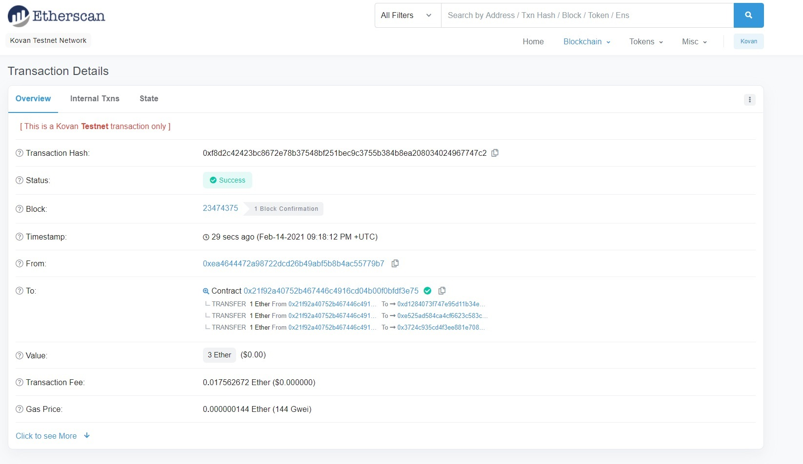

# Payroll_Simulator

## Associate Profit Splitter
* [Kovan Test Network Transaction Link](https://kovan.etherscan.io/tx/0xf8d2c42423bc8672e78b37548bf251bec9c3755b384b8ea208034024967747c2)
* 
* [Code](code/AssociateProfitSplitter.sol)
* How it works:
    * Input the 3 "Associate" accounts into the contract and then deploy.
    * Send however much ETH you would like to the contract address.
    * The contract will automatically disperse the funds.